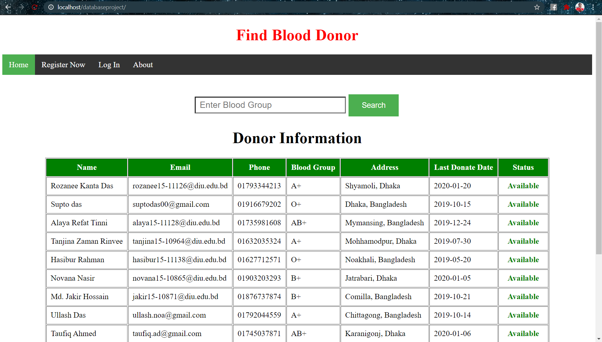
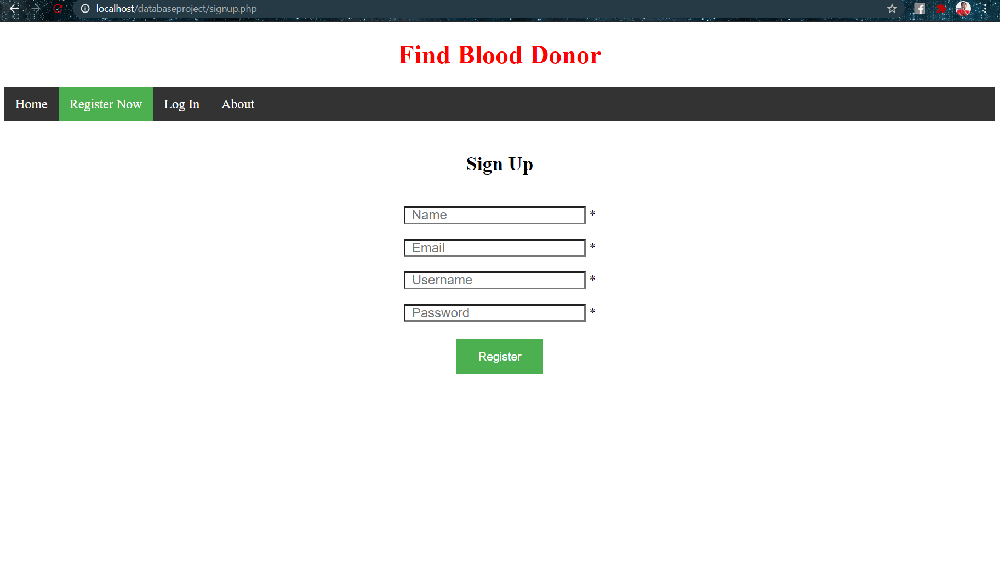
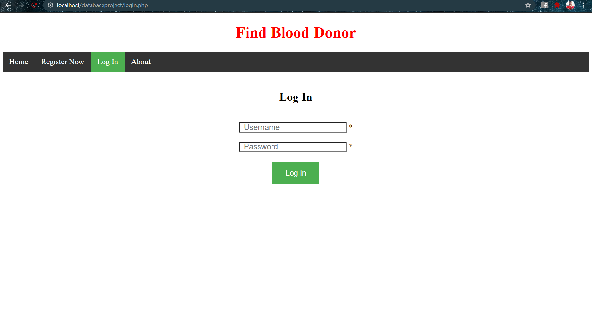
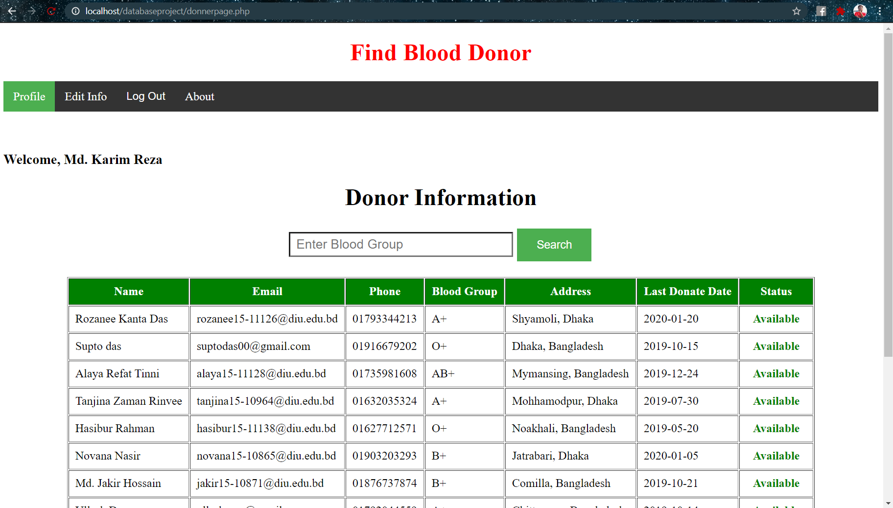
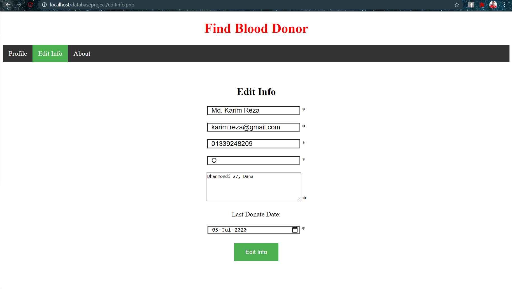

# Find-Blood-Donor
This is a Database Management System Course project. This is a website which help to find blood donor. 

# Features
- User can find all donor information
- User can search donar status serching by blood group
- User can register them into the website as a donor
- User can update their information like name, edit, phone number, address, blood group, last blood donate date
- User can also edit their insformation

# Use Tools
- Sublime Test Editor
- HTML5, CSS3 and PHP
- XAMPP Server
- MySQL Database

# Screen Shots

## Home
- Donor Information
- Search by Blood Group

## Registraton

## Log In

## Profile

## Edit Profile

